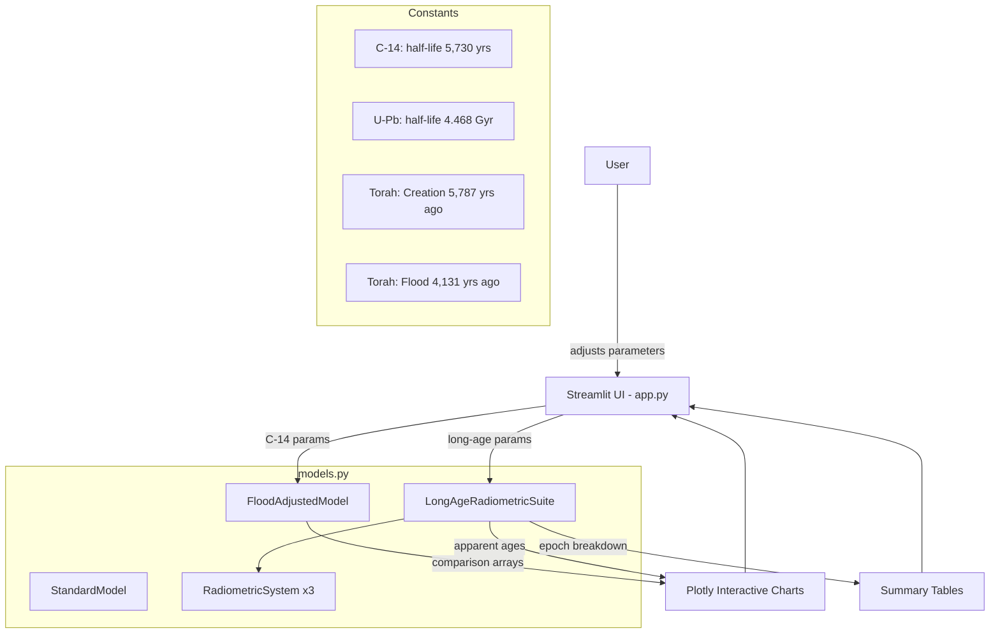

# Flood-Adjusted Radiometric Dating Simulator (FAC14)

An interactive simulation tool that models how a global catastrophic flood -- as described in the Torah -- would affect radiometric dating methods. Built with Python, Streamlit, and NumPy.

## Motivation

Standard radiometric dating assumes two things:

1. Radioactive decay rates have **always** been constant
2. Initial daughter isotope concentrations were **zero** (or known)

If either assumption is wrong, calculated ages can be off by orders of magnitude. This tool makes those assumptions explicit, adjustable, and visible -- so anyone can see exactly how a 5,787-year-old Earth produces measurements that say "4.5 billion years."

## What It Covers

### Carbon-14 Dating (Thousands of Years)
- **Pre-flood atmosphere:** Lower C-14 production due to water vapor canopy and stronger magnetic field
- **The Flood event:** Catastrophic disruption of C-14 equilibrium
- **Post-flood recovery:** Gradual C-14 buildup from near-zero to modern levels
- **Result:** A sample from the Flood era (~4,131 years ago) dates to ~30,000-50,000 years

### Long-Age Radiometric Dating (Billions of Years)
- **Uranium-Lead (U-Pb):** Half-life 4.468 billion years
- **Potassium-Argon (K-Ar):** Half-life 1.248 billion years
- **Rubidium-Strontium (Rb-Sr):** Half-life 48.8 billion years
- **Mechanism:** Accelerated nuclear decay during Creation Week (10^11x normal) + initial daughter isotopes from mature creation
- **Result:** Apparent ages of billions of years from rocks that are 5,787 years old

## Architecture



## Features

- **6 interactive tabs:** Big Picture (all methods compared), Long-Age Isotopes (epoch-by-epoch breakdown), C-14 Age Comparison, C-14 Ratio Over Time, Initial C-14 at Death, The Math (full equations)
- **14 adjustable parameters** via sidebar sliders covering pre-flood atmosphere, flood conditions, post-flood recovery, and decay acceleration
- **Real-time computation:** All charts update instantly as parameters change
- **The Math tab:** Shows every formula used, with worked examples at current settings
- **CLI mode:** Batch simulations via `fac14_main.py` with matplotlib output

## Running with Docker (Recommended)

```bash
# macOS / Linux
./fac14_service.sh

# Windows
fac14_service.bat

# Opens http://localhost:8501 automatically
# Menu options:
#   [k] Stop containers, keep images
#   [q] Stop containers, remove images
#   [r] Full reset and restart (rebuild from scratch)
```

### Prerequisites
- [Docker Desktop](https://www.docker.com/products/docker-desktop/) installed and running

## Running Locally (Without Docker)

```bash
# Install dependencies
pip install -r requirements.txt

# Run the Streamlit app
streamlit run app.py

# Or use the CLI
python fac14_main.py --age 5000 --model flood --plot
python fac14_main.py --help
```

### Prerequisites
- Python 3.13+
- pip

## Project Structure

```
flood-simulator/
├── app.py                 # Streamlit frontend (main entry point)
├── models.py              # Domain models, constants, isotope systems
├── simulation.py          # CarbonSimulation class (CLI-oriented)
├── visualization.py       # matplotlib + Plotly helpers for CLI
├── fac14_main.py          # CLI entry point
├── requirements.txt       # Python dependencies
├── Dockerfile             # python:3.13-slim + Streamlit
├── docker-compose.yml     # Single service on port 8501
├── fac14_service.sh       # macOS/Linux launcher
├── fac14_service.bat      # Windows launcher
├── docs/
│   ├── FLOOD_SIMULATOR_MASTER_PLAN.md
│   ├── status.md
│   └── versions.md
└── .claude/               # AI session configuration
```

## The Core Math

**Standard C-14 dating:**

```
t = -ln(R_measured) / lambda
lambda = ln(2) / 5730
```

Assumes initial ratio R_0 = 1.0. If R_0 was actually lower (pre-flood atmosphere), the overestimation is `-ln(R_0) / lambda` years.

**Long-age radiometric dating:**

```
t_apparent = (1/lambda) * ln(1 + D/P)
```

Assumes all daughter (D) came from in-situ decay of parent (P). If rocks were created with initial daughter isotopes and decay was accelerated during Creation Week, the formula produces billions of years from samples that are 5,787 years old.

## Phase Roadmap

| Phase | Description | Status |
|-------|-------------|--------|
| **Phase 1** | Streamlit interactive app with C-14 + long-age dating | Complete |
| **Phase 2** | FastAPI backend + React/TypeScript frontend | Planned |
| **Phase 3** | Additional isotope systems, geological column modeling, isochron diagrams | Planned |

## Key Parameters and Their Effects

| Parameter | Effect on Dating |
|-----------|-----------------|
| Pre-Flood C-14 Ratio (0.30) | Lower ratio = more age overestimation (organisms start with less C-14) |
| Water Vapor Canopy (0.70) | Blocks cosmic rays = less C-14 production |
| Magnetic Field (2x) | Deflects cosmic rays = less C-14 production |
| Creation Acceleration (10^11) | Packs billions of years of decay into 6 days |
| Initial Daughter Isotopes | Rocks created with "pre-aged" daughter products |
| Flood Temperature (100C) | Causes rapid carbon exchange in samples |
| Post-Flood Equilibrium (2000 yrs) | C-14 rebuilds slowly, making everything appear older |

## License

Private research project.