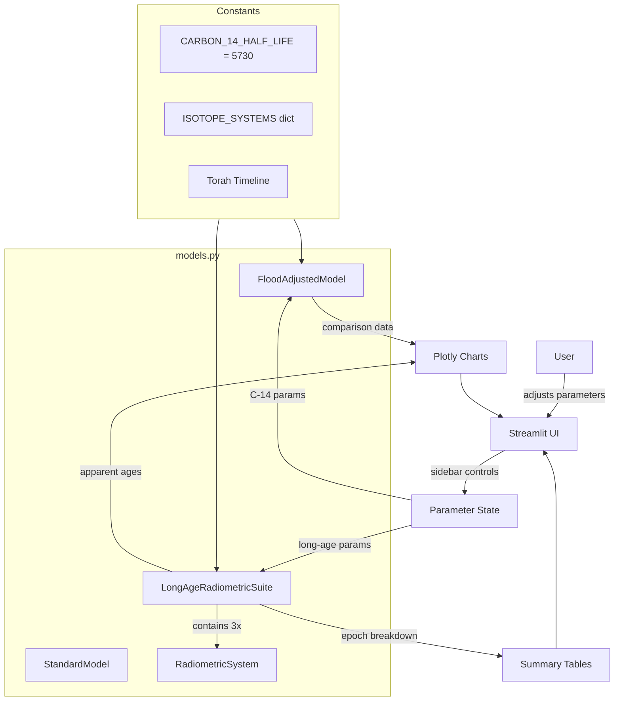
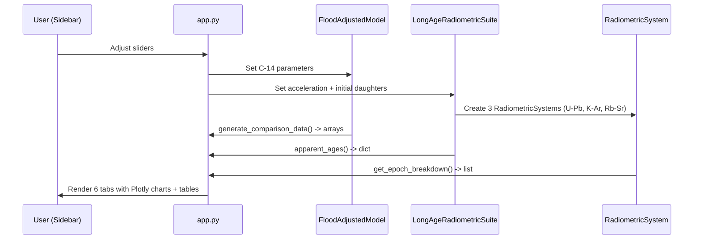
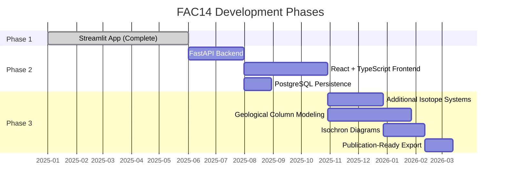

# Flood-Adjusted Radiometric Dating Simulator -- Master Plan

## 1. Project Goals and Motivation

### The Problem
Standard radiometric dating produces ages ranging from tens of thousands of years (C-14) to billions of years (U-Pb, K-Ar, Rb-Sr). These ages rest on two critical assumptions:

1. **Constant decay rates** -- radioactive decay has proceeded at exactly today's measured rate for the entire history of the sample.
2. **Known initial conditions** -- the initial amount of daughter isotope in the sample was zero (or a known quantity).

If either assumption is incorrect, the calculated ages are wrong -- potentially by orders of magnitude.

### The Thesis
The Torah describes two events that could invalidate both assumptions:

- **Creation Week** -- the universe was created in six days with mature initial conditions (rocks with initial daughter isotopes, a fully formed biosphere with atmospheric C-14 at a different equilibrium).
- **The Flood (Mabul)** -- a global catastrophic event in year 1656 from Creation that destroyed the pre-flood world, disrupted atmospheric C-14 equilibrium, and may have involved accelerated nuclear processes.

This simulator lets users adjust the parameters of these events and see exactly how they affect radiometric dating results -- using the same standard dating formulas that geologists use, but with different inputs.

### Why This Matters
This is not about "disproving science." The physics of radioactive decay is well-established. The question is about the **historical assumptions** fed into the dating formulas. This tool makes those assumptions explicit and adjustable, so anyone can see how the numbers change.

---

## 2. Architecture

### Data Flow

---

## 3. Phase Breakdown

### Phase 1: Streamlit Interactive App (COMPLETE)

**Goal:** A working interactive simulation tool that demonstrates the core thesis for both C-14 and long-age isotope systems.

**Deliverables:**
- Interactive Streamlit UI with sidebar parameter controls
- C-14 dating simulation with pre-flood, flood, and post-flood modeling
- Long-age radiometric dating for U-Pb, K-Ar, Rb-Sr
- 6 visualization tabs (Big Picture, Long-Age Isotopes, C-14 Age Comparison, C-14 Ratio, Initial C-14, The Math)
- CLI entry point for batch simulations
- Docker containerization
- Launcher scripts for macOS and Windows

**Gate criteria:**
- [x] All 6 tabs render correctly with default parameters
- [x] U-Pb apparent age reaches ~4.5 Gyr with default settings (creation accel 10^11, initial D/P 0.55)
- [x] C-14 flood-era sample dates to ~30,000+ years with default settings
- [x] Docker container builds and runs cleanly
- [x] Both launcher scripts functional

### Phase 2: FastAPI + React Upgrade

**Goal:** Replace Streamlit with a proper backend API and React frontend for better performance, UX, and extensibility.

**Deliverables:**
- FastAPI backend with typed Pydantic request/response models
- React 18 + TypeScript strict frontend with Vite
- Real-time parameter updates via WebSocket (slider changes stream results)
- Chart.js for 2D charts (replacing Plotly)
- PostgreSQL for saving simulation configurations and results
- User presets (save/load parameter sets)

**Architecture changes:**
- `models.py` splits into `backend/src/models/` (one file per model)
- `app.py` Streamlit code becomes React components
- New `backend/src/api/` with FastAPI routers
- New `frontend/` directory with full React scaffold

**Gate criteria:**
- [ ] All Phase 1 functionality reproduced in the new stack
- [ ] WebSocket streaming works for real-time parameter updates
- [ ] Presets can be saved and loaded from PostgreSQL
- [ ] 100% test coverage on backend
- [ ] Docker Compose with frontend + backend + postgres services

### Phase 3: Extended Simulation

**Goal:** Add advanced simulation capabilities for deeper geological analysis.

**Deliverables:**
- Additional isotope systems: Sm-Nd, Lu-Hf, Re-Os, U-Th
- Geological column modeling (sedimentary layer simulation under flood conditions)
- Isochron diagram generation (plot multiple samples on an isochron)
- Multi-sample concordance analysis (concordia diagrams for U-Pb)
- Export to publication-ready SVG/PDF figures
- Batch parameter sweeps (vary one parameter, plot the effect)

**Gate criteria:**
- [ ] All 7+ isotope systems modeled
- [ ] Isochron diagrams match standard geological format
- [ ] Concordia diagrams for U-Pb system
- [ ] Export produces print-quality figures

---

## 4. Technology Choices

| Choice | Reasoning |
|--------|-----------|
| **Python 3.13** | Latest stable, consistent with other projects |
| **Streamlit** | Fastest path to interactive simulation UI (Phase 1 only) |
| **NumPy** | Vectorized numerical computation for decay calculations |
| **Plotly** | Interactive charts in Streamlit (acceptable for Streamlit apps) |
| **matplotlib** | Static visualization for CLI and future export |
| **pandas** | Data export and tabular operations |
| **Docker + slim** | Consistent runtime, not Alpine (musl breaks scientific wheels) |
| **FastAPI** (Phase 2) | Async API with automatic OpenAPI docs, Pydantic integration |
| **React + TypeScript** (Phase 2) | Production frontend with strict types |
| **Chart.js** (Phase 2) | 2D charts in React, replacing Plotly |
| **PostgreSQL** (Phase 2) | Persistent storage for presets and results |

---

## 5. Cross-Phase Concerns

### Canonical unit system
- Time: **years** (not seconds, not days, except where epoch durations are naturally in days)
- Distance: **meters** for burial depth, **feet** for flood water depth (biblical/geological convention)
- Temperature: **Celsius**
- Isotope ratios: **dimensionless** (normalized to initial parent = 1.0)
- Decay constants: **per year** (lambda = ln(2) / half_life_years)

### Shared data models
The domain models in `models.py` are the foundation. Phase 2 wraps them in Pydantic request/response models but does not change the underlying physics. The `RadiometricSystem._evolve()` method and `FloodAdjustedModel.predict_measured_ratio()` are the core calculations that must remain identical across phases.

### Parameter ranges
These ranges are set in the Streamlit sliders and must be preserved in any future UI:

| Parameter | Min | Max | Default | Step |
|-----------|-----|-----|---------|------|
| Creation Week Acceleration (log10) | 0 | 12 | 11 | 0.5 |
| Flood Year Acceleration (log10) | 0 | 10 | 0 | 0.5 |
| U-Pb Initial D/P | 0 | 2 | 0.55 | 0.05 |
| K-Ar Initial D/P | 0 | 5 | 0.30 | 0.05 |
| Rb-Sr Initial D/P | 0 | 2 | 0.10 | 0.05 |
| Pre-Flood C-14 Ratio | 0.05 | 1.0 | 0.30 | 0.05 |
| Water Vapor Canopy Shielding | 0 | 0.95 | 0.70 | 0.05 |
| Magnetic Field Strength | 1 | 10 | 2.0 | 0.5 |
| Flood Temperature (C) | 20 | 300 | 100 | 10 |
| Water Depth (feet) | 1000 | 120000 | 90000 | 1000 |
| Equilibrium Years | 500 | 5000 | 2000 | 100 |
| Volcanic Activity Factor | 1.0 | 5.0 | 1.5 | 0.25 |
| Ocean Reservoir Factor | 0.20 | 1.0 | 0.60 | 0.05 |
| Burial Depth (meters) | 0 | 500 | 0 | 10 |

---

## 6. Key Reference Values

With default parameters, the simulator should produce approximately:

| Measurement | Expected Output |
|-------------|----------------|
| U-Pb apparent age | ~4.5 billion years |
| K-Ar apparent age | ~1-2 billion years |
| Rb-Sr apparent age | ~hundreds of millions of years |
| C-14 date for flood-era sample | ~30,000-50,000 years |
| True age of Earth (Torah) | 5,787 years |
| True time since Flood | 4,131 years |

These reference values should be validated in the test suite.

---

## 7. Future Considerations

### Isochron Diagrams (Phase 3)
An isochron plot shows multiple samples from the same rock on a D/P vs D/reference isotope graph. The slope gives the age. The flood model predicts that isochrons can appear linear (giving a "good" age) even when the actual history involved accelerated decay, because all samples in a rock experienced the same acceleration.

### Geological Column Modeling (Phase 3)
Model how flood-deposited sedimentary layers would be dated by different methods at different depths. Show how a single catastrophic event can produce an apparent sequence of ages spanning millions of years.

### Concordia Diagrams (Phase 3)
For the U-Pb system, two decay chains (U-238 -> Pb-206 and U-235 -> Pb-207) provide independent age estimates. A concordia diagram plots these against each other. Discordant ages (off the concordia curve) are typically attributed to lead loss, but can also result from accelerated decay with different acceleration factors for the two chains.